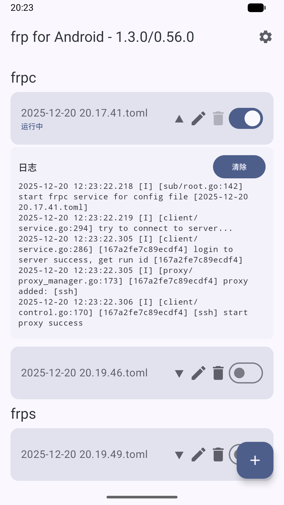
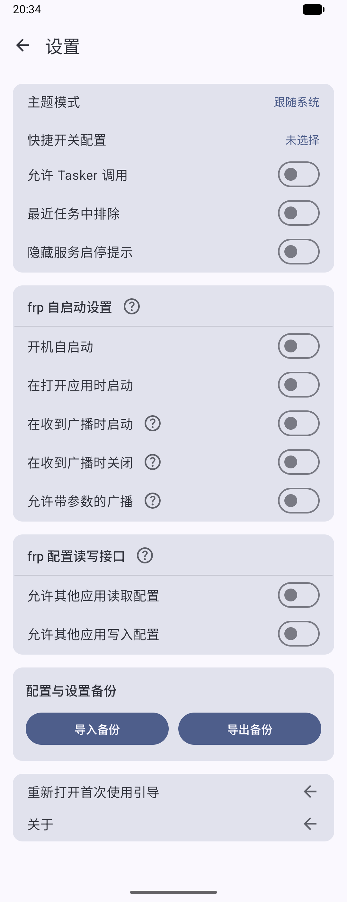

# frp-Android
A frp client for Android  
一个Android的frp客户端

简体中文 | [English](README_en.md)

<div style="display:inline-block">


</div>

## 编译方法

如果您想自定义frp内核，可以通过Github Actions或通过Android Studio编译

### (推荐) 通过Github Actions编译

1. 将您的apk签名密钥文件转为base64，以下为Linux示例
```shell
base64 -w 0 keystore.jks > keystore.jks.base64
```
2. fork本项目
3. 转到Github项目的此页面：Settings > Secrets and variables > Actions > Repository secrets
4. 添加以下四个环境变量：
```KEY_ALIAS``` ```KEY_PASSWORD``` ```STORE_FILE``` ```STORE_PASSWORD```  
其中```STORE_FILE```的内容为步骤1的base64，其他环境变量内容请根据您的密钥文件自行填写
5. Push提交自动触发编译或在Actions页面手动触发

### 通过Android Studio编译

1. 在项目根目录创建apk签名密钥设置文件```keystore.properties```, 内容参考同级的```keystore.example.properties```
2. 参考[脚本说明](./scripts/README.md)运行`update_frp_binaries`脚本以获取最新的frp内核文件，或者手动下载并放置到相应目录下
3. 使用Android Studio进行编译打包

## 常见问题
### 项目的frp内核(libfrpc.so)是怎么来的？
直接从[frp的release](https://github.com/fatedier/frp/releases)里把对应ABI的Linux版本压缩包解压之后重命名frpc为libfrpc.so  
项目不是在代码里调用so中的方法，而是把so作为一个可执行文件，然后通过shell去执行对应的命令  
因为Golang的零依赖特性，所以可以直接在Android里通过shell运行可执行文件

### 连接重试
在 frpc 配置中添加 `loginFailExit = false` 可以设置第一次登陆失败后不退出，实现多次重试。  
可以适用于如下情况：开机自启动时，网络还未准备好，frpc 开始连接但失败，若不设置该选项则 frpc 会直接退出

### DNS解析失败
从 v1.3.0 开始，arm64-v8a 架构的设备将改用 android 类型的 frp 内核以解决 DNS 解析失败的问题。
armeabi-v7a 和 x86_64 架构的设备仍然使用 linux 类型的 frp 内核，可能会存在 DNS 解析失败的问题，建议在配置文件使用 `dnsServer` 指定 DNS 服务器

### 开机自启与后台保活
App 按照原生 Android 规范设计，然而部分国产系统拥有更严格的后台管控，请手动在系统设置内打开相应开关。例如 ColorOS 16 退到后台会断开连接，在【应用设置->耗电管理->完全允许后台行为】之后恢复正常