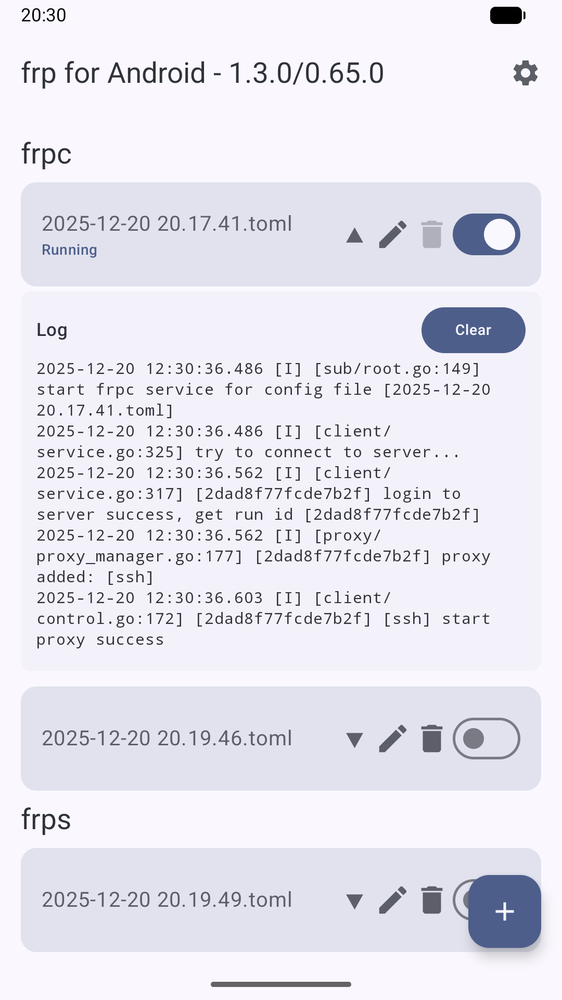
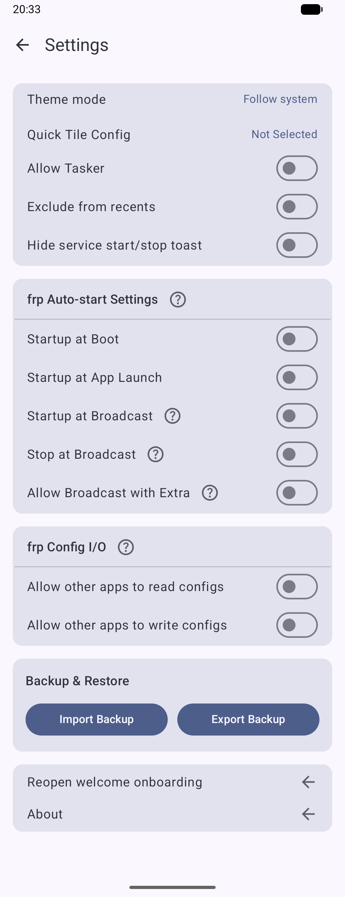

# frp-Android
A frp client for Android  
一个Android的frp客户端

[简体中文](README.md) | English

<div style="display:inline-block">


</div>

## Compilation Methods

If you wish to customize the frp kernel, you can compile it via Github Actions or through Android Studio.

The key-related steps below are optional; if you skip them, the app will be signed with Android's public default debug key.

### (Recommended) Compiling via Github Actions

1. Fork this project.
2. (Optional) Convert your APK signing key file to base64; here's a Linux example:
```shell
base64 -w 0 keystore.jks > keystore.jks.base64
```
3. (Optional) Navigate to this page of the Github project: Settings > Secrets and variables > Actions > Repository secrets.
4. (Optional) Add the following four environment variables:
```KEY_ALIAS``` ```KEY_PASSWORD``` ```STORE_FILE``` ```STORE_PASSWORD```  
The content for ```STORE_FILE``` should be the base64 from step 2, while you should fill in the other environment variables according to your key file.
5. A push commit will automatically trigger compilation, or you can manually trigger it on the Actions page. When triggering manually, you may enter a specific frp kernel version tag to download (for example, v0.65.0); leave it blank or trigger automatically to download the latest version.

### Compiling via Android Studio

1. (Optional) Create an APK signing key configuration file named ```keystore.properties``` at the root directory of the project, referencing the existing ```keystore.example.properties``` file at the same level.
2. Refer to the [script instructions](./scripts/README.md) to run the `update_frp_binaries` script to obtain the latest frp kernel files, or manually download and place them in the appropriate directories.
3. Compile and package using Android Studio.

## FAQs
### Where does the frp kernel (libfrpc.so) of the project come from?
It is obtained directly by extracting the corresponding ABI Linux version archive from [frp's release](https://github.com/fatedier/frp/releases), renaming frpc to libfrpc.so.  
The project does not invoke methods from the so file within its code but treats the so as an executable file, executing the corresponding command through shell.  
Due to Golang's zero-dependency characteristic, the executable file can be run directly through shell in Android.

### Connection Retry
Add `loginFailExit = false` to the frpc configuration to prevent exiting after the first login failure, enabling multiple retry attempts.  
This is useful in scenarios such as auto-start on boot, where the network may not be ready when frpc starts to connect and fails. Without this option, frpc will exit immediately after a failed attempt.

### DNS Resolution Failure
Starting from v1.3.0, devices with the arm64-v8a architecture use the android type frp kernel to solve DNS resolution issues.  
Devices with armeabi-v7a and x86_64 architectures still use the linux type frp kernel, which may have DNS resolution problems. It is recommended to specify a DNS server using the `dnsServer` option in the configuration file.

### Start at Boot and Background Keep-Alive
The app is designed according to the native Android specification. However, some custom Android systems have stricter background management. Please manually enable the relevant options in the system settings. For example, on ColorOS 16, the connection may be disconnected when the app is sent to the background. After enabling [App Settings -> Power Management -> Fully Allow Background Activity], it will work normally.

### Can I change the kernel version in the app? Can multiple frp kernels be bundled?
Simply put: no. Please follow the compilation methods above to bundle your required kernel and build the APK.

Since [Android 10+ removed execute permissions from the app's main directory](https://developer.android.com/about/versions/10/behavior-changes-10#execute-permission), it is impossible to dynamically download and run a new frp kernel file; only the needed kernel version packaged inside the APK can be executed.

User needs vary and cannot be covered by a few bundled versions, so it is recommended that you compile your own build with the kernel version you need.

There are other approaches, for example:

- [NekoBoxForAndroid](https://github.com/MatsuriDayo/NekoBoxForAndroid) developed a plugin system to separate binaries into an APK plugin.
- [termux](https://github.com/termux/termux-exec-package) uses certain techniques to execute binaries in restricted environments.

However, these solutions are relatively complex, and with limited time and capability, they are not implemented here.

### BroadcastReceiver usage example
Make sure to enable the corresponding "Startup at Broadcast" / "Stop at Broadcast" switches in Settings:

```shell
# Start all configs with Auto-start enabled
adb shell am broadcast -a io.github.acedroidx.frp.START io.github.acedroidx.frp

# Stop all configs with Auto-start enabled
adb shell am broadcast -a io.github.acedroidx.frp.STOP io.github.acedroidx.frp

# Operate on a specific config only (examples with extras)
adb shell am broadcast -a io.github.acedroidx.frp.START -e TYPE frpc -e NAME example.toml io.github.acedroidx.frp
adb shell am broadcast -a io.github.acedroidx.frp.STOP  -e TYPE frpc -e NAME example.toml io.github.acedroidx.frp
```

### ContentProvider config access example
Before using, turn on the "frp Config I/O" read/write switches in Settings and be aware of the possible disclosure of config passwords.

```shell
# List all configs (requires "Allow read")
adb shell content query --uri content://io.github.acedroidx.frp.config

# Read a single config (requires "Allow read")
adb shell content read --uri content://io.github.acedroidx.frp.config/frpc/example.toml

# Write a single config (requires "Allow write")
# Overwrite the device config with local example.toml
adb shell content write --uri content://io.github.acedroidx.frp.config/frpc/example.toml < example.toml
```

- In-app quick validation: long-press the config edit button on the main list to open the config with a third-party app via ContentProvider (requires read/write switches enabled).